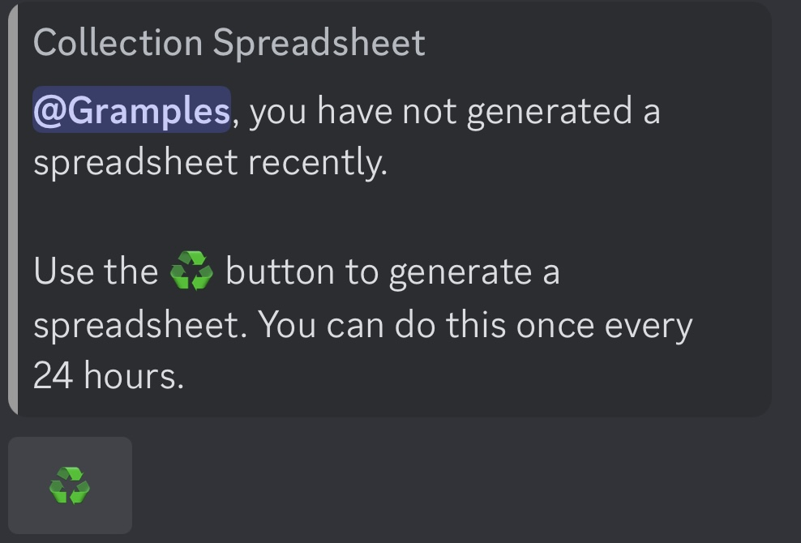
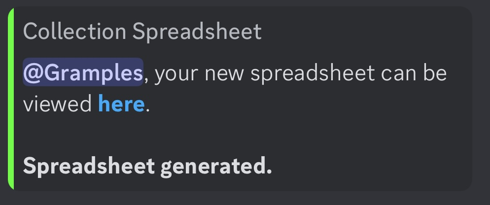
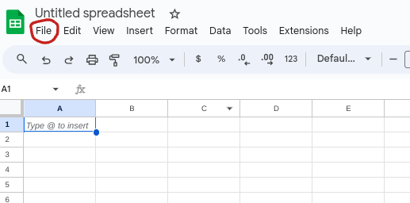
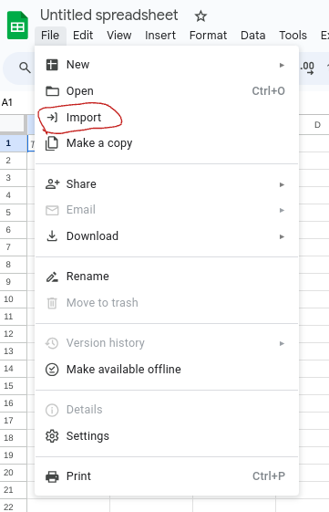

# Karuta Price Calculator
A tool to convert your Discord Bot Karuta spreadsheet into a list of prices using the Keqing bot pricing guide.

## Setup
1. Download your spreadsheet from Karuta.

    To find the spread sheet use the command 
    ```
    kspreadsheet
    ```
    That will return an imbed that looks like this. Click on the generate button to generate your spreadsheet.

    

    Once you click on generate it should return an imbed that looks similar to this. Click on the highlighted here button to download the spreadsheet.

    

2. Download the release from the github page

   If you are on the github page that should be directly to the right, and if not you can find the page by going [here](https://github.com/TheKLCD/karuta-calculator).

3. Replace the example CSV with your own

   Replace the current example spreadsheet with your own spreadsheet in the folder and rename your spreadsheet "Example.csv". Remember to delete the old example. You could also achieve this by physically copy and pasting the contents of your spreadsheet replacing the current contents of the example.

4. Run the Main file
   
   You are going to need Java installed to run the program. If you do not have it downloaded you can download it [here](https://www.java.com/download/ie_manual.jsp "Java Download").

5. Take the output file and bring it to a spreadsheet viewer.

    This Guide will use [Google Sheets](https://www.google.com/sheets/about/ "Google Sheets") as an example but this will work for any spreadsheet viewer that accepts .csv files.

    Create a new blank sheet and click on the file button on the top right.

    

    From there you want to click on the import button to import a spreadsheet from your device.

    

    Click on browse and choose the spreadsheet from the workspace folder on your device. You can leave the default options for the import but if you are using a different spreadsheet viewer and they ask for the separator type, select comma.

6. Enjoy!

    You should now be looking at your spreadsheet in order of ticket price, descending. It should also be ready to be copy and pasted for any selling advertisements.

## Other Information and Links

The spreadsheet should automatically order the cards in order of calculated ticket value. The value 9999 means that a value can't be calculated. This would appear for any single prints (single digit print) or edition 6 cards, due to there being no easy calculator for those cards.

[Karuta Information](https://www.karuta.com "Karuta")

[Keqing Information](https://www.keqingbot.com "Keqing")